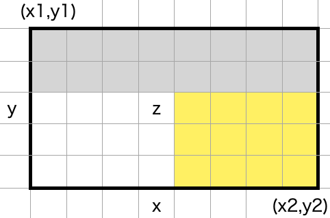
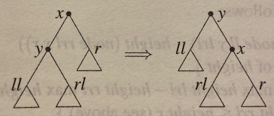
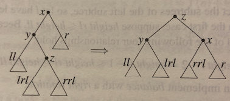
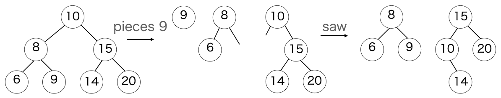

<!-- 
theme: gaia
size: 16:9
paginate: true
-->
# 第四章　Binary search (二分探索)
#### 分割統治法の最もシンプルな一例
* 元データを二分し，二つの部分問題へ分割
* 二分探索の特徴は，部分問題がトリビアルであること

二つの例をみた後，二分探索をデータ構造（二分探索木）にカプセル化する

---
### 4章1節 : 一次元探索問題
### 4章2節 : 二次元探索問題
### 4章3節 : 二分探索木
### 4章4節 : Dynamic Sets

---
# 4章1節 : 一次元探索問題

---
# 4-1 線形探索
#### 自然数の狭義単調増加関数 $f\ \small(x < y \Rightarrow f(x) < f(y))$
t = f xとなるxを探すことを考えると...
```haskell
search :: (Nat -> Nat>) -> Nat -> [Nat] -- 線形探索
search f t = [x | x <- [0 .. t], t == f x]
```
単一要素リストあるいは空リストを得る．
より良い解法を二つ紹介

---
# 4-1 部分問題で考える
```haskell
search f t = seek (0,t) where
    seek (a,b) = [x | x <- [a .. b], t == f x]
```
seekを改良
```haskell
seek (a,b) = [x | x <- [a .. m-1], t == f x] -- t < f m の時のみ
          ++ [m | t == f m]
          ++ [x | x <- [m+1 .. b] == f x] -- t > f m の時のみ
```

値が片側のリストにしか存在しない性質を利用する．

---
# 4-1 二分探索1
```haskell
-- 二分探索 (ver 1)
search :: (Nat -> Nat) -> Nat -> [Nat]
search f t = seek (0,t)
    where seek (a,b) | a > b = []
                     | t < f m = seek (a,m-1)
                     | t == f m = [m]
                     | otherwise = seek (m+1,b)
                     where m = choose (a,b)
                           choose (a,b) = (a+b) `div` 2 -- 2つの部分問題をバランスする
```
* 計算時間 : $\small O(\log{t})$．

---
# 4-1 二分探索1の問題点
* $2^{512}$ is so huge. (Integerでは動くけど時間を消費する)
* 各ステップで$f$を二回評価，また最大3回の比較操作
### 解決法
1. $\scriptsize f(a) \lt t \le f(b)$となる(a,b)を見つける
2. 区間$\scriptsize [a+1,b]$のみを探索
3. $\scriptsize t \le f(0)$の時は
    $\scriptsize f(-1) = -\inftyとして(a,b) = (-1,0)$

---
# 4-1 二分探索2
$\scriptsize f(2^{p-1} \lt t \le 2^p)$となる$\scriptsize p$を探索
```haskell
bound :: (Nat -> Nat) -> Nat -> (Int,Nat)
bound f t = if t <= f 0 then (-1,0) else (div b 2, b)
    where b = until done (*2) 1
          done b = t <= f b
```
* 評価回数 ... p+1回
最良時 : $\small O(\log(\log n)) ... \scriptsize f(n)=2^n$
    最悪時 : $\small O(\log n) ... \scriptsize f = id$


---
$\scriptsize t \le b$より，区間$\scriptsize [a+1,b]$で$\scriptsize t \le x$を満たす最小の$\scriptsize x$は存在する
```haskell
search f t = if f x == t then [x] else []
    where x = smallest (bound f t)
          smallest (a,b) = head [x | x <- [a+1..b], t <= f x] -- 線形探索
```
上のsmallest関数の定義は線形探索．先ほどと同様，$\scriptsize a < m < b$となる$\scriptsize m$を使って下の通り書き下すと，部分問題に分割できる．
```hs
smallest (a,b) = head ( [x | x <- [a+1 .. m], t <= f x] ++
                        [x | x <- [m+1 .. b], t <= f x] )
```

---
関数の全容
```haskell
-- 二分探索 (ver 2)
search :: (Nat -> Nat) -> Nat -> [Nat]
search f t = if f x == t then [x] else []
    where x = smallest (bound f t) f t

smallest (a,b) f t | a+1 == b = b
                   | t <= f m = smallest (a,m) f t
                   | otherwise = smallest (m,b) f t
                   where m = (a+b) `div` 2
```
* $\scriptsize a \lt x \le b$に解がなければbを返す
* 比較回数は1回．最悪2回
* $\scriptsize f(a)$は評価されることがないので$\scriptsize f(-1) = -\infty$も呼ばれない

---
# 4-1 二分探索2の計算量
#### $f(n)$について，$T(n)$を考える
$\small 
T(2) = 0 \\
T(n) = 1+T(n/2)
     = k + T(n/2^k) \le \lceil \log{n} \rceil
$
$
\scriptsize\therefore n = 2^{k+1} \rightarrow T(n) = k, \\
\ \ \ \ n \neq 2^{k+1} \rightarrow 2^k \lt n \lt 2^{k+1}
$

fの計算時間が一定の場合，ステップ数は $\small\Theta(\log{t})$

---
部分問題がいずれもn/2でない場合
Exercise 4-3

次章で登場する$\scriptsize T(n) = 2T(n/2) + \Theta(n)$については：
$\small 
T(n) = cn + 2T(n/2) \\
    = cn+2(cn/2 + 2T(n/4)) \\
    = 2cn + 4T(n/4) \\
    = ... \\
    = kcn + 2^kT(n/2^k) \\
    = cn\lceil \log n \rceil + \Theta(2^{\lceil \log n \rceil}) \\
    \longrightarrow \Theta(n\log n)
$　線形対数時間

<!--
# 4-1 課題
Exercise 4-1 ~ 4-4
-->

---
# 4章2節 二次元探索

---
# 4-2 グリッド探索
狭義単調増加関数 $\small : f(x,y) = t \ \ \{x,y,t \in \mathrm{N}\}$

$f$ : p.67 Figure.1
```hs
search f t = [(x,y) | x <- [0 .. t], y <- [0 .. t], t == f (x,y)]
```
$\Rightarrow\Theta(t^2)$のステップ数
$\small\forall{x}\exists{y},\{0\le x\le t\},\ \small t\le f(x,y)$となるxで探索打ち切り．

$\longrightarrow$ 3種類の二分探索実装法

---
## 其の壱：サドルバック探索
左上から探索
```hs
search f t = [(x,y) | x <- [0 .. t], y <- [t,t-1 .. 0], t == f (x,y)]
```
探索区間を設け，発生しうる状況で場合わけ
```haskell
search f t = searchIn (0,t) -- サドルバック探索
    where searchIn (x,y) f t | y < 0  || t < x = []
                             | z < t = searchIn (x + 1,y)
                             | z == t = (x,y):searchIn (x + 1,y - 1)
                             | t < z = searchIn (x,y - 1)
                             where z = f (x,y)
```

---
評価回数 : $\small\Theta(t)$
#### 最良ケース：探索は左上-右下への対角線上
評価回数 : $\small min\ p\ q$　　(探索範囲$\small p\times q$)
e.g. $\scriptsize f(x,y)=x^2+3^y, t=20259$
#### 最悪ケース：探索は左下-右上への対角線上
評価回数 : $\small p+q-1$

---
# 其の弐：改良サドルバック探索
(0,t), (t,0)両側から探索
```haskell
p = smallest (-1,t) (\y -> f (0,y)) t
q = smallest (-1,t) (\x -> f (x,0)) t
```
$\small\longrightarrow\Theta(\log{t})+\Theta(p+q) \simeq\Theta(\log{t}) \ \ \scriptsize(\because p,q < t)$

---
# 其の参：分割統治サドルバック

$$\tiny
f(x,y) < t \rightarrow 　　白色領域を破棄 \\
f(x,y) = t \rightarrow 左下・右上領域を破棄
$$

---
### 最悪計算量を考える $\scriptsize (m\times n領域の探索)$
* $\small m = 0 \vee n = 0$
$T(m,n) = 0$
* $\small m=1 \vee n=1$
$T(1,n) = 1+T(1,\frac{n}{2})$
$T(m,1) = 1+T(\frac{m}{2},1)$
* $\small m\ge2\land n\ge2$
$T(m,n) = 1+T(\frac{m}{2},\frac{n}{2}) + T(\frac{m}{2},n),\scriptsize\ horizontal\ cut \ (m \le n)$
$T(m,n) = 1+T(\frac{m}{2},\frac{n}{2}) + T(m,\frac{n}{2}),\scriptsize\ vertical\ cut \ (m \gt n)$

---
$\small U(i,j) = T(2^i,2^j), i \le j \ \ \scriptsize(=horizontal)$　として考える

$\small U(0,j) = j$
$\small U(i+1,j+1) = 1+U(i,j) + U(i,j+1)$

$\scriptsize U(i,j) = 2^if(i,j)-1$　とおくと...

$f(0,j) = j+1$
$2f(i+1,j+1) = f(i,j) + f(i,j+1)$　　を得る

$\longrightarrow$ $f$は$i,j$に関して線形関数：$\small f(i,j) = \frac{i}{2}+j+1$

---
結果として
$U(i,j) = 2^i(j-\frac{i}{2}+1)-1$　を得る

$\therefore T(m,n) = 2^{\log m}(\log n-\frac{\log m}{2}+1)-1 \le m\log{\frac{2n}{\sqrt{m}}}$

---
$\small m,n$一方が極端に小さい場合，サドルバックより分割統治法がbetter．
分割統治法をもう少し改良する．

__前提__
1. 探索範囲を$\small(x_1,y_1),(x_2,y_2)$領域に限定
2. $\small y_1-y_2 \le x_1-x_2$

```haskell
x = smallest (x1 - 1,x2) (\x -> f (x,r)) t
r = (y1+y2) `div` 2
```

---
$\small x_1 \le x \le x_2$の範囲に条件を満たす$x$があれば，
$\small t \le f(x,r)$となる$t$が存在．それ以外は$x = x_2$とする
* $\small t \lt f(x,r) \rightarrow$ 灰色黄色領域を探索
* $\small t \gt f(x,r) \rightarrow$ rの下側を探索
* $\small t = f(x,r) \longrightarrow$ x行を削除&灰色黄色領域を探索 
分割統治法．図で$\small z = f(x,r)$
<!--これにより，対数時間で配列の凡そ半分を除去できる-->

---
```
sb_search' f t = from (0,p) (q,0) where
    p = smallest (-1,t) (\y -> f (0,y)) t
    q = smallest (-1,t) (\x -> f (x,0)) t
    from (x1,y1) (x2,y2)
        | x2 < x1 || y1 < y2 = []
        | y1-y2 <= x1-x2 = row x
        | otherwise = col y
        where
        x = smallest (x1-1,x2) (\x -> f(x,r)) t
        y = smallest (y2-1,y1) (\y -> f(c,y)) t
        c = (x1+x2) `div` 2
        r = (y1+y2) `div` 2
        row x   |  z < t = from (x1,y1) (x2,r+1)
                | z == t = (x,r):from (x1,y1) (x-1,r+1)++from (x+1,r-1) (x2,y2)
                |  t < z = from (x1,y1) (x-1,r+1) ++ from (x,r-1) (x2,y2)
                where z = f (x,r)
        col y   |  z < t = from (c+1,y1) (x2,y2)
                | z == t = (c,y):from (x1,y1) (c-1,y+1)++from (c+1,y-1) (x2,y2)
                |  t < z = from (x1,y1) (c-1,y) ++ from (c+1,y-1) (x2,y2)
                where z = f (c,y)
```
---
# 計算量 $\scriptsize(m \le n)$
* **best case**
$\small T(m,n) = \log n + T(\frac{m}{2},n) = \Theta(\log m\times\log n)$
* **worst case**
$T(m,n) = \log n+2T(\frac{m}{2},\frac{n}{2}) = \Theta(m\log(1+\frac{n}{m}))$

いずれの探索アルゴリズムも計算量の下限は
$\small\Omega(m\log(1+\frac{n}{m})+n\log(1+\frac{m}{n}))$

---
* $\small m=n \rightarrow \Omega(m+n)$　サドルバッグ．
* $\small m \lt n \rightarrow \Omega(m\log(m+n))$　
    * $\scriptsize x \le \log(1+x)\ \ (0 \le x \le 1の時)$

--- 
#### Proof. 
計算量の下限は，次節の後半で触れる決定木によって証明される
問題に対して，$\small A(m,n)$個の異なる解があると仮定する．

$\scriptsize
A(1,1) = 1 \ \ ([],A_{11})\\
A(2,2) = 6 \ \ ([],A_{ij}, [A_{1i}A_{2j}]) \ \ (\because 狭義単調増加関数)\\
$

$\scriptsize
f(x,y) \rightarrow 3\ \ (\because (<), (==), (>))
$　であるから
$\scriptsize
h \ge \log_3A(m,n)
$

$\small A(m,n)$を計算することで下限がもとまる

---
$\small 0 \le x < n, 0 \le y < m, f(x,y) = z$
を，左上から右下まで階段状に対応させる

n回の下移動 & m回の右移動　

$\scriptsize
A(m,n) := \left( \begin{array}{c} m+n\\n\end{array}\right)$

---
別の方法：k個の解があると仮定：
$\scriptsize
A(m,n)=\Sigma^{m}_{k=0}
\left(\begin{array}{c}m\\k\end{array}\right)
\left(\begin{array}{c}n\\k\end{array}\right)
=\left(\begin{array}{c}m+n\\n\end{array}\right) \\
\scriptsize \because ヴァンデルモンドの畳み込み：
\Sigma^r_{k=0}{}_mC_k\cdot{}_nC_{r-k} = {}_{m+n}C_r
$

よって
$\small 
\log{A(m,n)} = \Omega(m\log(1+n/m) + n\log(1+m/n))
$

<!--
# 4-2 課題
Exercise 4-5, 4-6
-->

---
# 4章3節 : 二分探索木

前章のランダムアクセスリストとは異なり，  
値は葉ではなくノード（ラベル）に記録

```haskell
data Tree a = Null | Node (Tree a) a (Tree a)
```

木は分岐構造に分類される

---
<!--前章のランダムアクセスリストとは異なり，値は葉ではなく節に記録-->
```haskell
size :: Tree a -> Nat
size Null = 0
size (Node l x r) = 1 + size l + size r
```
```haskell
flatten :: Tree a -> [a]
flatten Null = []
flatten (Node l x r) = flatten l ++ [x] ++ flatten r
```
flattenは木の大きさに対して線形ではない（演習3-8）
flattenが単調増加リストを返すとき，木は二分探索木である

<!--3-8でみたようにflattenは線形ではない．詳しくはExerciseで-->
二分探索木：左部分木の要素 < 節の要素 < 右部分木の要素

---
辞書探索に使われる，keyによって探索する方式
```haskell
search :: Ord k => (a -> k) -> k -> Tree a -> Maybe a
search key k Null = Nothing
search key k (Node l x r)
    | key x  < k = search key k r
    | key x == k = Just x
    | key x  > k = search key k l
```
最悪の場合は木の高さに比例した計算量 $\rightarrow O(\log n)$を保証
```haskell
height :: Tree a -> Nat
height Null = 0
height (Mode l x r) = 1 + max (height l) (height r)
```

---
## 木の高さとサイズの関係
同サイズの木が同じ高さである必要はなく，高さhとサイズnは
$\small\
lceil \log(n+1) \rceil \le h \le n \lt 2^h,
h\ge \lceil \log(n+1) \rceil$を満たす．

左/右部分木の高さの差が最大でも1のとき，木はバランスしている．
（他にもバランスの定義は色々あるらしい...）

バランス状態での高さは，$\small \lceil \log(n+1) \rceil$である必要はないが，
適度に小さく，
$\small h \le 1.4404\log(n+1)+\Theta(1)$
で与えられる

---
#### Proof.
$H(n)$ ... サイズnの木がとりうる最大の高さ
$S(h)$ ... 高さhの木がとりうる最小サイズ

$\rightarrow S(H(n)) \le n$

$\small S(n)$に下限$\small f(n)$を設けることで，$\small H(n)$の上限を求める
$\small S(n) \ge f(n)$の時，
$\small n \ge f(H(n)) \Rightarrow  H(n) \le f^{-1}(n)$

---
#### Proof. 続き
* $\small Null ... h=0, S(0) = 0$
* $\small h=1 ... S(1) = 1$
* $\small S(h+2) = S(h+1) + S(h) + 1 \longrightarrow S(h) = Fib(h+2)-1$

**fibonacci数**
$\scriptsize
Fib(0) = 0 \\
Fib(1) = 1 \\
Fib(k+2) = Fib(k+1) + Fib(k) \\
$

---
#### Proof. 続き
$\small x^2-x-1=0$の二つの解，$\small \phi=\frac{1+\sqrt{5}}{2},\ \ \psi\frac{1-\sqrt{5}}{2}$

$\small fib(n) = (\phi^n - \psi^n)/\sqrt5$
$\small fib(n) > (\phi^n - 1)/\sqrt5 \ \ \scriptsize(\because \psi < 1)$

したがって前ページの式を適用して，

$\small (\phi^{H(n)+2}-1)/\sqrt5-1 \le fib(H(n)+2)-1 = S(H(n)) \le n$

$\Rightarrow (H(n)+2)\log\phi \lt \log(n+1)+\Theta(n)$
$\blacksquare$

---
## 木の構築
```haskell
mktree :: Ord a=> [a] -> Tree a
mktree [] = Null
mktree (x:xs) = Node (mktree ys) x (mktree zs)
    where   (ys,zs) = partition (<x) xs
partition f xs = (filter f xs, filter (not.f) xs)
```
* 長さnのリストをn/2長に分割 ... $\small T(n+1) = 2T(n/2)+\Theta(n)$
$\Rightarrow T(n) = \Theta(n\log n)$
* リストxsを[]とxsに分割する時 ... $\small T(n+1) = T(n) + \Theta(n)$
$\Rightarrow T(n) = \Theta(n^2)$

---
## 平衡木の構築
平衡木を保証するmktreeには，部分木の高さ情報が必要
```haskell
data Tree a = Null | Node Nat (Tree a) a (Tree a)
```
```haskell
height Null = 0
height (Node h _ _ _) = h
```
```haskell
node :: Tree a -> a -> Tree a -> Tree a
node l x r = Node h l x r where h = 1 + max (height l) (height r)
```

---
```haskell
mktree :: Ord a => [a] -> Tree a
mkTree = foldr insert Null

insert x Null = node Null x Null
insert x (Node h l y r)
    | x  < y = balance (insert x l) y r
    | x == y = Node h l y r -- 重複は破棄
    | y  < x = balance l y (insert x r)
```
balance関数：高さ情報を使って平衡を維持 (3ケースを考慮)

1. $h(l) = h(r) + 2$
1. $h(ll) < h(rl)$
1. $h(r) = h(l)+2$

---
1. $\scriptsize h(l) = h(r)+2 = h(ll)-1 \le h(rl) \le h(ll)$
```haskell
balance l x r = rotr (node l x r) -- 右回転のbalance関数
rotr (Node _ (Node _ ll y rl) x r) = node ll y (node rl x r)
```

$\scriptsize |h(ll) - h(node\ rl\ x\ r)|$
$\scriptsize = |h(ll) - 1 - h(rl) \max\ h(r)|$
$\scriptsize = |h(ll) - 1 - h(rl)| \le 1$

---
2. $\small h(ll) \lt h(rl) \Rightarrow h(ll)+1 = h(rl)　(lは平衡)$
```haskell
balance l x r = rotr (node (rotl l) x r)
rotl (Node _ ll y (Node _ lrl z rrl)) = node (node ll y lrl) z rrl
```

$\scriptsize |h(node\ ll\ y\ lrl) - h(node\ rrl\ x\ r)|$
$\scriptsize = |h(ll) \max h(lrl) - h(rrl) \max h(r)|$
$\scriptsize = |h(ll) \max h(lrl) - h(r)|$
$\scriptsize = |h(ll)-h(r)| = 0$

---
3. $\small h(r) = h(l)+2$ ... 2.と同様
```haskell
-- balance関数全体
bias :: Tree a -> Int
bias (Node _ l x r) = height l = height r

balance :: Tree a -> a -> Tree a -> Tree a
balance t1 x t2
    | abs (h1-h2) <= 1 = node t1 x t2
    | h1 == h2+2       = rotateR t1 x t2
    | h2 == h1+2       = rotateL t1 x t2
    where h1=height t1; h2 = height t2

rotateR t1 x t2 = if 0 <= bias t1 then rotr (node t1 x t2)
                                  else rotr (node (rotl t1) x t2)
rotateL t1 x t2 = if bias t2 <= 0 then rotl (node t1 x t2)
                                  else rotl (node t1 x (rotr t1))
```

---
### 高さが3以上異なる木t1,t2の平衡
* 前提：$\small h1 \gt h2+2$
t1の右部分木$r=r_k$について　$\small 0\le h(r) - h(t2) \le 1$
を満たす部分木は確実に存在する（1or2ずつ高さが低くなる）

$\small |h(l) - h(node\ r\ x\ t_2)| \le 2$ ... balance関数で結合可能

---
```haskell
balanceR :: Set a -> a -> Set a -> Set a
balanceR (Node _ l y r) x t2 = if height r >= height t2+2
    then balance l y (balanceR r x t2)
    else balance l y (node r x t2)

balanceL :: Set a -> a -> Set a -> Set a
balanceL (Node _ l y r) x t2 = if height l >= height t2+2
    then balance (balanceL l x t2) y r
    else balance (node l x t2) y r

type Set a = Tree a
```
balanceR, balanceL ... $\small O(|h1-h2|)$

---
```haskell
gbalance :: Set a -> a -> Set a -> Set a
gbalance t1 x t2
    | abs (h1-h2) < 2 = balance  t1 x t2
    | h1 > h2+2       = balanceR t1 x t2
    | h1+2 < h2       = balanceL t1 x t2
    where h1 = height t1; h2 = height t2
```
* balance関数 ... 定数時間
* gbalance関数 ... 挿入は対数時間，構築は$\small\Theta(n\log{n})$

Q. $\Theta(n\log{n})$より高速にリストから木を構築できる？

---
```haskell
sort :: Ord a => [a] -> [a]
sort = flatten . mktree
```
比較回数 $\small B(n) \ge \Omega(n\log{n})　\because$ 決定木とスターリン近似

A. $\small \Theta(n\log{n})$より高速にはできない

<!---
# 4-3 課題
Exercise 4-7 ~ 4-16
-->
---
# 4章4節 : 動的木 (Dynamic Sets)

---
成長・縮退可能な木の集合 ... add, delete, elem，union, split

```haskell
member :: Ord a => a -> Set a => Bool
member x Null = False
member (Node _ l x r) | x < y  = member x l
                      | x == y = True
                      | x > y  = member x r

delete :: Ord a => a -> Set a => Set a
delete x Null = Null
delete (Node _ l x r) | x < y  = balance (delete x l) y r
                      | x == y = combine l r
                      | x > y  = balance l y (delete x r)
```
---
## 高さの差が高々1の平衡木の連結
```haskell
deleteMin :: Ord a => Set a -> (a,Set a)
deleteMin (Node _ Null x r) = (x,r)
deleteMin (Node _ l x r) = (y,balance t x r) where (y,t) = deleteMin l

combine :: Ord a => Set a -> Set a -> Set a
combine l Null = l
combine Null r = r
combine l r = balance l x t where (x,t) = deleteMin r
```
高さの差が2以上の木の連結ついてはgbalanceを用いる
大きさがそれぞれm,nの木の連結 ... $\small O(\log{n}+\log{m})$

---
```haskell
-- 木の分割 --
data Piece a = LP (Set a) a | RP a (Set a)

-- split x xs = (ys,zs) ⇄ combine ys zs = xs
split :: ord a => a -> Set a -> (Set a, Set a)
split x t = sew (pieces x t)
```
一度ピースに分解してから，それぞれを縫い合わせることで実現



---

```haskell
pieces :: Ord a => a -> Set a -> [Piece a]
pieces x t = addPiece t [] where
    addPiece Null ps = ps
    addPiece (Node _ l y r) ps | x < y = addPiece l (RP y r : ps)
                               | x >=y = addPiece r (LP l y : ps)

sew :: [Piece a] -> (Set a,Set a)
sew = foldr step (Null,Null)
    where step (t1,t2) (LP t x) = (gbalance t x t1, t2)
          step (t1,t2) (RP x t) = (t1, gbalance t2 x t)
```
split, pieces, saw ... $\small O(h)$

---
# Excercise
## 4-1.1
floor関数の性質　　$n \le \lfloor r \rfloor \iff n \le r \ \ \small(n \in N, r \in R)$
を使って　　$a+1\lt b$の時のみ　　$a \lt (a+b)\ div\ 2 \lt b$
となることを証明せよ

$\small a \lt div\ (a+b)\ 2 \lt b$
$\small a \lt \lfloor\frac{a+b+1}{2}\rfloor \lt b \ \ (\because floor)$

$\small \lfloor\frac{a+b+1}{2}\rfloor \lt b$　　を満たすには，$\small a+1 < b$　　が必要

---
## 4-1.2
ceiling関数の性質　　$r \le \lceil n \rceil \iff r \le n \ \ \small(n \in N, r \in R)$
を使って　　$n \lt 2^h$の時に　　$\lceil \log(n+1)\rceil\le h$
となることを証明せよ

$\small n < 2^h$
$\small \log n \lt h$
$\small \log (n+1) \lt h \iff \lceil\log(n+1)\rceil\le h$

---
## 4-2
```haskell
-- a < m < b, f(a) < t <= f(b)を満たすものとする
head $ [x | x <- [a+1..m], t <= f x] ++ [x | x <- [m+1..b], t <= f x]
```
f(m) < tの時，第一項リストは空にもかかわらずsmallest関数は値を返す．なぜ


smallest関数は範囲内に解がない時bを返す実装になっている

---
## 4-3
最悪条件でsmallest関数が必要とするステップ数$\small n (=b-a+1)$を，
$\scriptsize T(2) = 0$
$\scriptsize T(n) = T(\lceil(n+1)/2\rceil)+1 \ \ \ \ (n\gt2)$
$\scriptsize T(n) = \lceil\log(n-1)\rceil$　　を用いて求めよ

$\scriptsize 
T(n) = T(\lceil(n+1)/2\rceil)+1 = \lceil \log(n-1)\rceil \\
\rightarrow 
$

---
## 4-4
4-3で，$\small f(a) \lt t \le f(b)$のとき，
$\small t\le f(x)$の形で$\small\lceil \log(n-1) \rceil$の比較を要するsmallest (a,b) f tを計算するアルゴリズムを示す．

---
## 4-5
図4.1上で472のインデックスは？

---
## 4-6
$f(x,y) = x^3+y^3$のとき，saddleback関数での$t=1729$の探索結果は？

---
## 4-7
flatten関数を線形時間にするのにaccumulateを使う．flatcatを再帰定義する
```haskell
flatcat :: Tree a -> [a] -> [a]
flatcat t xs = flatten t ++ xs

flatten = flatcat t []
```

```
flatten :: Tree a -> [a]
flatten (Node tl a tr) = fla
```

---
## 4-8
全ての二分木$t$について  $\small height(t) \le size(t) \lt 2^{height(t)}$を証明

1. 全要素が左部分木のみにある場合が最悪条件：$\scriptsize height(t) \le size(t)$

2. 全ての要素がバランスしている時が最悪条件：
$\scriptsize size(t) = 2^m$の時，$\scriptsize height(t) = m+1$
$\scriptsize 2^m \lt size(t) \lt 2^{m+1}$の時，$\scriptsize height(t) = m+1$

$\scriptsize\therefore height(t) \le size(t) \lt 2^{height(t)}$

---
## 4-9
2回走査している実装を，1回操作にする
```haskell
partition p xs = (filter p xs, filter (not.p) xs)
```

```haskell
partiton p xs = (positives, negatives)
    where
    (positives, negatives) = foldr f ([],[]) xs
    f (ps,ns) x
        | p x = (x:ps, ns)
        | not (p x) = (ps,x:ns)
```

---
## 4-10
Tree [a] を構築する

---
## 4-11
best case  : $\small B(n+1) = 2B(n/2)+\Theta(n)$
worst case : $\small W(n+1) = W(n)+\Theta(n)$
$二分探索木構築時のB(n), W(n)$を求めよ

$B(n) = 2^{n/2}B(0) + n/2\Theta(n/2^n)$
$B(n) = n\Theta(\log n)$
$B(n) = \Theta(n\log n)$

$W(n) = W(0) + n\Theta(n) \rightarrow \Theta(n^2)$

---
## 4-12
$\log{n!} = \Omega(n\log{n})$,　$W(n) = \Theta(n^2)$　を示す


---
## 4-13
combineの二つ目の定義として，
```haskell
flatten (combine t1 t2) = flatten t1 ++ flatten t2
```
次の章を見越して，次のmergeを定義せよ
```haskell
flatten (union t1 t2) = merge (flatten t1) (flatten t2)
 ```

 --- 
 ## 4-14-1
 union関数の一例：木の一つを展開し，要素を別の木に一つずつ挿入する方法
 ```haskell
 union :: Ord a => Set a -> Set a -> Set a
 union t1 t2 = foldr insert t1 (flatten t2)
 ```
 t1の要素数 = m，t2の要素数 = n　の時，union関数の計算量は？


 --- 
 ## 4-14-2
 union関数の一例：両方の木を展開・マージしてソートされたリストを作成してから木を構築する．（配列を使えば線形時間でリスト→木の変換が可能）
 
 ```haskell
 union t1 t2 = build (merge (flatten t1) (flatten t2))
 build xs = from (0,n) (listArray (0,n-1) where n = length xs)
 ```
1. from関数を定義せよ．
1. union関数の計算量は？

---
## 4-15
deleteMin関数，combine関数の定義でbalance関数が正当化されるのはなぜ？

---
## 4-16
balanceLの定義

---
## 4-17
次のpair関数を使って，```split x```関数の線形版を一行で定義する
```haskell
pair f (x,y) = (f x, f y)
```


```haskell
split :: Ord a => a -> Set a -> (Set a, Set a)
split x = pair mkTree . partiton (<=x) . flatten
```