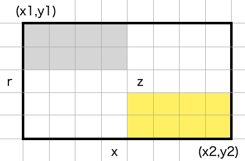

<!-- 
theme: gaia
size: 16:9
paginate: true
-->
# 第四章　Binary search (二分探索)
#### 分割統治法の最もシンプルな一例
* 元データを二分し，二つの部分問題へ分割
* 二分探索の特徴は，部分問題がトリビアルであること

二つの例をみた後，二分探索をデータ構造（二分探索木）にカプセル化する

---
# 章立て
### 4章1節 : 一次元探索問題
### 4章2節 : 二次元探索問題
### 4章3節 : 二分探索木
### 4章4節 : Dynamic Sets


---
# 4章1節 : 一次元探索問題

---
# 4-1 線形探索
#### 自然数の狭義単調増加関数 $f (x < y \Rightarrow f x < f y)$
```
t = f x
```
となるxを探すことを考えると...
```haskell
search :: (Nat -> Nat>) -> Nat -> [Nat] -- 線形探索
search f t = [x | x <- [0..t], t == f x]
```
単一要素リストあるいは空リストを得る．

---
# 4-1 部分問題で考える
```haskell
search f t = seek (0,t) where
    seek (a,b) = [x | x <- [a,b], t == f x]
```
seekを書き下す
```haskell
seek (a,b) = [x | x <- [a .. m-1], t == f x] -- t < f m の時のみ
          ++ [m | t == f m]
          ++ [x | x <- [m+1 .. b] == f x] -- t > f m の時のみ
```

値が片側のリストにしか存在しない性質を利用する．

---
# 4-1 二分探索1
```haskell
-- 二分探索 (ver 1)
search :: (Nat -> Nat) -> Nat -> [Nat]
search f t = seek (0,t)
    where seek (a,b) | a > b = []
                     | t < f m = seek (a,m-1)
                     | t == f m = [m]
                     | otherwise = seek (m+1,b)
                     where m = choose (a,b)
                           choose (a,b) = (a+b) `div` 2 -- 2つの部分問題をバランスする
```
* 計算時間 : $O(\log{t})$．
* 関数の型定義に問題あり．e.g. $\scriptsize f(n) = 2^n,\ n = 1024$

---
# 4-1 二分探索1の問題点
* $2^{512}$ is so huge. (Integerでは動くけど時間を消費する)
* 各ステップで$f$を二回評価，また最大3回の比較操作
### 解決法
1. $\scriptsize f(a) \lt t \le f(b)$となる(a,b)を見つける
2. 区間$\scriptsize [a+1,b]$のみを探索
3. $\scriptsize t \le f(0)$の時は
    $\scriptsize f(-1) = -\inftyとして(a,b) = (-1,0)$

---
# 4-1 二分探索2
$\scriptsize f(2^{p-1} \lt t \le 2^p)$となる$\scriptsize p$を探索
```haskell
bound :: (Nat -> Nat) -> Nat -> (Int,Nat)
bound f t = if t <= f 0 then (-1,0) else (div b 2, b)
    where b = until done (*2) 1
          done b = t <= f b
```
* 評価回数 ... $O(\log(\log n))$
    なお，最悪時には$O(\log n)$ : e.g. $\scriptsize f = id$
* $\scriptsize t \le b$より，区間$\scriptsize [a+1,b]$で$\scriptsize t \le x$を満たす最小の$\scriptsize x$は存在する

---
```haskell
search f t = if f x == t then [x] else []
    where x = smallest (bound f t)
          smallest (a,b) = head [x | x <- [a+1..b], t <= f x] -- 線形探索
```
上のsmallest関数の定義は線形探索．先ほどと同様，$\scriptsize a < m < b$となる$\scriptsize m$を使って下の通り書き下すと，部分問題に分割できる．
```hs
smallest (a,b) = head ( [x | x <- [a+1 .. m], t <= f x] ++
                        [x | x <- [m+1 .. b], t <= f x] )
```
したがって次の関数を得る

---
```haskell
-- 二分探索 (ver 2)
search :: (Nat -> Nat) -> Nat -> [Nat]
search f t = if f x == t then [x] else []
    where x = smallest (bound f t) f t

smallest (a,b) f t | a+1 == b = b
                   | t <= f m = smallest (a,m) f t
                   | otherwise = smallest (m,b) f t
                   where m = (a+b) `div` 2
```
#### smallest関数
* $\scriptsize a \lt x \le b$に解がなければbを返す
* 比較回数は1回．最悪2回
* $\scriptsize f(a)$は評価されることがないので$\scriptsize f(-1) = -\infty$も呼ばれない，

---
# 4-1 二分探索2の計算量
#### $f(n)$について，$T(n)$を考える
$
T(2) = 0 \\
T(n) = T(n/2) + 1
     = k + T(n/2^k) \le \lceil \log{n} \rceil
$
$
\scriptsize\therefore n = 2^{k+1} \rightarrow T(n) = k, \\
\ \ \ \ n \neq 2^{k+1} \rightarrow 2^k \lt n \lt 2^{k+1}
$

fの計算時間が一定の場合，ステップ数は $\small\Theta(\log{t})$

---
# 4-1 課題

---
# 4章2節 二次元探索

---
# 4-2 グリッド探索
狭義単調増加関数 $\small : f(x,y) = t \ \ \{x,y,t \in \mathrm{N}\}$

$f$ : p.67 Figure.1
```hs
search f t = [(x,y) | x <- [0 .. t], y <- [0 .. t], t == f (x,y)]
```
$\Rightarrow\Theta(t^2)$のステップ数
$\small\forall{x}\exists{y},\{0\le x\le t\},\ \small t\le f(x,y)$となるxで探索打ち切り．

$\longrightarrow$ 3種類の二分探索実装法

---
## 其の壱：サドルバック探索
左上から探索
```hs
search f t = [(x,y) | x <- [0 .. t], y <- [t,t-1 .. 0], t == f (x,y)]
```
探索区間を設け，発生しうる状況で場合わけ
```haskell
search f t = searchIn (0,t) -- サドルバック探索
    where searchIn (x,y) f t | y < 0  || t < x = []
                             | z < t = searchIn (x + 1,y)
                             | z == t = (x,y):searchIn (x + 1,y - 1)
                             | t < z = searchIn (x,y - 1)
                             where z = f (x,y)
```

---
評価回数 : $\small\Theta(t)$
#### 最良ケース：探索は左上-右下への対角線上
評価回数 : $\small min\ p\ q$　　(探索範囲$\small p\times q$)
e.g. $\scriptsize f(x,y)=x^2+3^y, t=20259$
#### 最悪ケース：探索は左下-右上への対角線上
評価回数 : $\small p+q-1$

---
# 其の弐：改良サドルバック探索
(0,t), (t,0)両側から探索
```haskell
p = smallest (-1,t) (\y -> f (0,y)) t
q = smallest (-1,t) (\x -> f (x,0)) t
```
$\small\longrightarrow\Theta(t)+\Theta(p+q) \simeq\Theta(t) \ \ \scriptsize(\because p,q < t)$

---
# 其の参：分割統治サドルバック

$$\tiny
f(x,y) < t \rightarrow 　　黄色領域を探索\\
f(x,y) = t \rightarrow 灰・黄色領域を維持\\
f(x,y) > t \rightarrow 　　灰色領域を探索
$$

---
### 最悪計算量を考える $\scriptsize (m\times n領域の探索)$
* $\small m = 0 \vee n = 0$
$T(m,n) = 0$
* $\small m=1 \vee n=1$
$T(1,n) = 1+T(1,\frac{n}{2})$
$T(m,1) = 1+T(\frac{m}{2},1)$
* $\small m\ge2\land n\ge2$
$T(m,n) = 1+T(\frac{m}{2},\frac{n}{2}) + T(\frac{m}{2},n),\scriptsize\ horizontal\ cut \ (m \le n)$
$T(m,n) = 1+T(\frac{m}{2},\frac{n}{2}) + T(m,\frac{n}{2}),\scriptsize\ vertical\ cut \ (m \gt n)$

---
$\small U(i,j) = T(2^i,2^j), i \le j \ \ \scriptsize(=horizontal)$　と定義する

$\small U(0,j) = j$
$\small U(i+1,j+i) = 1+U(i,j) + U(i,j+1)$

$\scriptsize U(i,j) = 2^if(i,j)-1$　とおくと...

$f(0,j) = j+1$
$2f(i+i,j+1) = f(i,j) + f(i,j+1)$　　を得る

$\longrightarrow$ $f$は$i,j$に関して線形関数：$\small f(i,j) = \frac{i}{2}+j+1$

---
結果として
$U(i,j) = 2^i(j-\frac{i}{2}+1)-1$　を得る

$\therefore T(m,n) = 2^{\log m}(\log n-\frac{\log m}{2}+1)-1 \le m\log{\frac{2n}{\sqrt{m}}}$

$\small m,n$一方が極端に小さい場合，サドルバックより分割統治法．

```haskell
x = smallest (x1 - 1,x2) (\x -> f (x,r)) t
r = (y1+y2) `div` 2
```

---
* $\small z = f(x,r) \longrightarrow$ x行を削除して灰色黄色領域を探索
* $\small otherwize \longrightarrow$ 灰色黄色領域を探索
分割統治法


---
```
sb_search' f t = from (0,p) (q,0) where
    p = smallest (-1,t) (\y -> f (0,y)) t
    q = smallest (-1,t) (\x -> f (x,0)) t
    from (x1,y1) (x2,y2)
        | x2 < x1 || y1 < y2 = []
        | y1-y2 <= x1-x2 = row x
        | otherwise = col y
        where
        x = smallest (x1-1,x2) (\x -> f(x,r)) t
        y = smallest (y2-1,y1) (\y -> f(c,y)) t
        c = (x1+x2) `div` 2
        r = (y1+y2) `div` 2
        row x   |  z < t = from (x1,y1) (x2,r+1)
                | z == t = (x,r):from (x1,y1) (x-1,r+1)++from (x+1,r-1) (x2,y2)
                |  t < z = from (x1,y1) (x-1,r+1) ++ from (x,r-1) (x2,y2)
                where z = f (x,r)
        col y   |  z < t = from (c+1,y1) (x2,y2)
                | z == t = (c,y):from (x1,y1) (c-1,y+1)++from (c+1,y-1) (x2,y2)
                |  t < z = from (x1,y1) (c-1,y) ++ from (c+1,y-1) (x2,y2)
                where z = f (c,y)
```
---
# 計算量 $\scriptsize(m \le n)$
* best case
$\small T(m,n) = \log n + T(\frac{m}{2},n) = \Theta(\log m\times\log n)$
* worst case
$T(m,n) = \log n+2T(\frac{m}{2},\frac{n}{2}) = \Theta(m\log(1+\frac{n}{m}))$

いずれの探索アルゴリズムも計算量は
$\small\Omega(m\log(1+\frac{n}{m})+n\log(1+\frac{m}{n}))
\scriptsize　　決定木で証明可能(教科書参照)$


---
# 4-3 二分探索木
```haskell
data Tree a = Null | Node (Tree a) a (Tree a)
```
<!--前章のランダムアクセスリストとは異なり，値は葉ではなく節に記録-->
```haskell
size :: Tree a -> Nat
size Null = 0
size (Node l x r) = 1 + size l + size r
```
```haskell
flatten :: Tree a -> [a]
flatten Null = []
flatten (Node l x r) = flatten l ++ [x] ++ flatten r
```
<!--3-8でみたようにflattenは線形ではない．詳しくはExerciseで-->


---
# Excercise